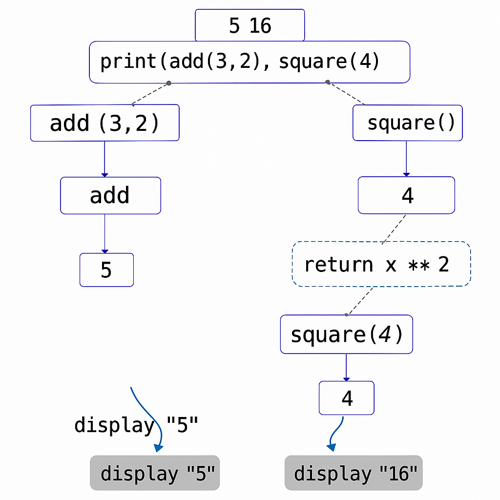
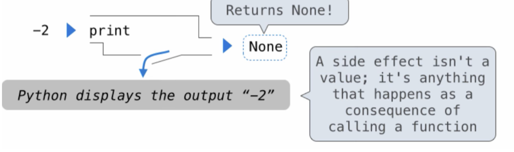
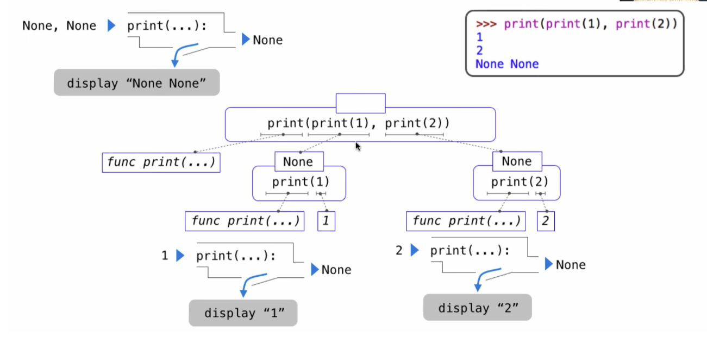

# CS61A：Print 初探（附图解）

 孩子们CS61A真的做的太好了我巴不得写100篇。

下期讲C语言的printf。

观前提醒：本文使用的知识内容包括：自定义函数，print函数嵌套，所有的指令均在命令行进行。

[TOC]

------


## **一、print函数的基础使用**

​    顾名思义就是print（打印）。比如：

```python
>>> -2
-2
>>> print(-2)
-2
```

​    但正如上面所看到的，直接打-2也可以输出-2，为什么要用`print`？

​    在下面的代码中我们就可以看出两者的差别：

```python
>>> "hello"
'hello'
>>> print("hello")
hello
>>> None
>>> print(None)
None
```


​      其中的核心在于：`print`的规则是**自动显示内部输入的任何表达式的值**，因此尽管None不会显示任何信息也会被`print`忠实地打印下来。

​    `print`还可以同时打印多个数据，并把逗号转化为空格。

```python
>>> print(1,2,3)
1 2 3
>>> print(None,None)
None None
>>> print('hello','world')
hello world
```

​    我们还可以在`print`的表达式中调用函数：

```python
>>> def square(x):
...     return x**2
...
>>> from operator import add
>>> print(add(3,2),square(4))
5 16
```


​    我们用图解来表示这个过程（图像由GPT生成，虽然还是很丑但差不多是这个意思）：



​    `print`函数首先运行的是`add(3,2)`，调用函数`add()`，求出`add(3,2)=5`，然后调用自定义函数`square()`得到16，最后再回到print函数输出5 16。

​    从这个例子中我们也可以意识到，==当我们运行函数的时候，他会先把里面的函数的值全部求出来，再用print输出==，在下面的内容我们会有更深的理解。

## **二、print函数的嵌套以及运行顺序**

​    如果我们输入print(print(1),print(2))会怎么样？

```python
>>> print(print(1),print(2))
1
2
None None
```


这个None是什么鬼，为什么会有这样的结果？

事实上`print`是`Non-Pure Function`，这意味着`print`函数除了输入和输出是有side effect的，而这个副作用就是打印值。


我们可以通过代码进行验证

```python
>>> a = print(1)
1
>>> a
>>> print(a)
None
```


同时我们需要注意的是，python的`print`是自带换行符的。

现在按照我们前面提到的所有的点，让我们用这个例子串起来吧——

①当我们运行`print`的时候需要先把里面的值全部求出来，才会用`print`进行打印；

②`print`运行的时候，作为调用语句的副作用，会打印出括号内的值，同时本身有返回值None；

③`print`在打印出值后会自动换行。

那么聪明的你就可以理解为什么是这样的结果了，同样我们用图像分解一下（图片来自CS61A）：


要运行`print(print(1),print(2))`首先要分别运行`print(1)`，`print(2)`，换行打印side effect 1和2，同时返回None None，最后输出`print(None,None)`，把逗号换成空格，得到None None。

来试试这个课后小题吧！用代码确认你的答案！

```python
>>> def square(x):
...     print("result:")
...     return x**2
...
>>> from operator import add
>>> print(1,print(add(3,2)),square(4))
```


