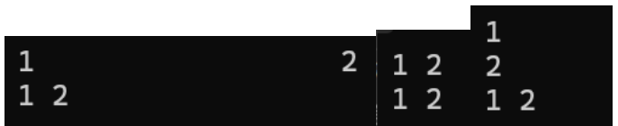

# 【C语言】scanf 和 printf 整理


> > 
> 觉得有帮助的话可以点点蓝链[Mem0rin](https://blog.csdn.net/2501_93882415?type=blog )给主包csdn点个小小的关注吗orz

`scanf`和`printf`需要引入头文件<stdio.h>

部分编译器会认为`scanf`不安全，请在开头加上备注语句`#define _CRT_SECURE_NO_WARNINGS 1`食用~

觉得有帮助的话给小编点个赞吧~

**目录**

[一、`printf`函数的使用：](#一、`printf`函数的使用：)

[`printf`函数的基本用法](#`printf`函数的基本用法)

[`printf`函数的占位符](#`printf`函数的占位符)

[`printf`对数据长度的限制](#`printf`对数据长度的限制)

[1.限制最小输出长度](#1.限制最小输出长度)

[2.最大长度](#2.最大长度)

[ 3.其他格式](# 3.其他格式)

[二、`scanf`函数](#二、`scanf`函数)

[`scanf`函数的基本用法](#`scanf`函数的基本用法)

[`scanf`函数的占位符特例](#`scanf`函数的占位符特例)

[`scanf`函数的多值输入和赋值忽略符](#`scanf`函数的多值输入和赋值忽略符)

[三、`printf`和`scanf`函数的返回值](#三、`printf`和`scanf`函数的返回值)

[常见数据的占位符](#常见数据的占位符)

[`printf`常用的占位符：](#`printf`常用的占位符：)

[`scanf`常用占位符：](#`scanf`常用占位符：)

------


# 一、printf函数的使用：

## printf函数的基本用法

​    和上文的`print`函数一样，`printf`的作用也是打印参数文本。`printf`的f是format的意思，格式参数就是`printf`的第一个引号的参数。比如如果我要打印“Hello”，我可以这么做：

```cpp
#include<stdio.h>


int main() {
    `printf`("Hello");
    return 0;
}

>>>Hello
```


​    其中"Hello"是参数。

## printf函数的占位符

​    我们也可以用占位符来实现这点：

```cpp
#include<stdio.h>


int main() {
    `printf`("Hello\n");
    `printf`("%s", "Hello");
    return 0;
}

>>>Hello
Hello
```


​    这里我们来讲一下什么是占位符：

​    我对`printf`的占位符的理解是：填空题，占位符相当于给要输出的语句中挖空，然后再由逗号后面的数据填进去。其中%就类似于提示，告诉你这个填空题是什么类型的。

​    也就是说，占位符起到了指代数据及其类型的作用，不同的%对应不同的参数。

​    用具体的例子来看：

```cpp
#include<stdio.h>


int main() {
    `printf`("%s is %d years old.", "Tom", 18);
    return 0;
}

>>>Tom is 18 years old.
```


​    `%s`对应的是字符串，`%d`对应的是`int`类型数字，对号入座进第一个参数"%s is %d years old."并进行输出。

​    需要注意的是，占位符是和逗号后的参数按照顺序一一对应的，不能换序，数据类型也要进行对应，否则无法处理。如果我用的是`printf("%s is %d years old.", 18, "Tom")`，编译器就会警告并什么都不会输出。

​    与此同时占位符和参数的数量呈现n比n+1的关系，也就是说如果`printf`中有n个占位符，那么就会有n+1个参数，至于这个1是怎么来的，因为作为输出格式的format（eg."%s is %d years old."）也是一个参数。


​    到这里可能你会有这样的疑问：我直接`printf("Tom is 18 years old.")`不就好了，为什么要用到占位符呢。事实上，对于常量来说确实是这样的。但是对于变量来说的输出来说就很有用了。

​        比如如果我现在想要输出1到100的所有3的倍数，我可以这么写

```cpp
#include<stdio.h>


int main() {
    for (int i = 1; i <= 100; i++) {
        if (i % 3 == 0) {
            `printf`("%d是3的倍数\n", i);
        }
    }
    return 0;
}
```

​    因此我们可以意识到占位符在输出变量的时候就显得很有必要了，毕竟每次变量的值都是不一样的，不能一概而论地放进format中。

​    常见的数据类型的占位符放在文章最后。

## `printf`对数据长度的限制

### 1.限制最小输出长度

`%[n]d`表示至少输出n位整型参数（也可以换成`%f`，`%c`）如果长度大于等于n就没有影响，如果参数长度小于n，则在左边补上空格，`%-nd`表示至少输出n位整型参数，在右侧补上空格。

比如：

```cpp
#include<stdio.h>


int main() {
    int a = 1;
    int b = 123456;
    `printf`("-----%5d-----\n", a);
    `printf`("-----%-5d-----\n", a);
    `printf`("-----%5d-----\n", b);
    `printf`("-----%-5d-----\n", b);
    `printf`("-----%12f-----\n", 123.45);
    `printf`("-----%-5c-----", 'A');
    return 0;
}
>>>
-----    1-----
-----1    -----
-----123456-----
-----123456-----
-----  123.450000-----
-----A    -----
```


​    需要注意的是对于小数，这个限定符会限定所有数字的长度。小数默认显示精度为6位，所以123.45前面只有两个空格。

### 2.最大长度

​    `%.[n]f`表示保留n位小数，

四舍五入

​    `%.[n]s`表示输出字符串前n位,

​    `%[n].[m]f`表示至少有n位，且保留m位小数。可以通过`%*.*f`用*代替再用参数传入。

​    比如：

```cpp
#include<stdio.h>


int main() {
    char c[20] = "hello world!";
    float b = 123.456;
    `printf`("-----%.2f-----\n", b);
    `printf`("-----%8.2f-----\n", b);
    `printf`("-----%*.*f-----\n",8, 2, b);
    `printf`("-----%.5s-----\n", c);
    
    return 0;
}

>>>
-----123.46-----
-----  123.46-----
-----  123.46-----
-----hello-----
```


###  **3.其他格式**

​    一般情况下`printf`输出整数不会显示正号，如果需要的话可以使用`%+d`

```cpp
#include<stdio.h>


int main() {
    `printf`("%+f\n", 123.45);
    `printf`("%+f\n", -123.45);
    `printf`("%+d\n",8);
    `printf`("%+d\n",-8);
    
    return 0;
}

>>>
+123.450000
-123.450000
+8
-8
```


# 二、scanf函数

## scanf函数的基本用法

​    有输出自然就有输入。``scanf``函数的作用是为变量赋值。基本语法与`printf`一样：

```cpp
#define _CRT_SECURE_NO_WARNINGS 1
#include<stdio.h>


int main() {
    int a;
    `scanf`("%d", &a);//把输入的值存储进a
    `printf`("%d", a+1);
    return 0;
}

>>>
4 //输入的a
5
```


​    其中占位符起到了指示数据类型的作用。这是因为C语言的数据都是有类型的，必须提前知道用户输入的数据类型，才能处理数据。

​    对比`scanf`和`printf`我们会发现多出来了一个&，这是因为**`scanf`输入的是地址**，也就是把变量的地址传递到输入的地址，如果是指针的话就不用加了。

​    `scanf`可以同时给多个变量赋值，比如

```cpp
scanf("%d%d%f%f", &i, &j, &x, &y);
```


​    `scanf`函数处理输入的数据的时候，**除了`%c`**，都会自动忽略空格，换行符，制表符等，因此数据之间有一个或多个空格或者回车并不影响数据的读入。



​    可以看出效果是一样的。

​    `scanf`读取数据的原理是，**电脑会先把输入的数据放在缓存区，按下回车键后按顺序进行读取，读取到第一个不符合条件的字符停止**。

​    比如：

```cpp
#define _CRT_SECURE_NO_WARNINGS 1
#include<stdio.h>


int main() {
    int i,j;
    char c;
    float x;
    scanf("%d%c%d%f", &i, &c, &j, &x);
	printf("i=%d, c=%c, j=%d, x=%f\n", i, c, j, x);
    return 0;
}

>>>123c123.23
i=123, c=c, j=123, x=0.230000
```


​    `%d`读取到123，c不是整型，因此由`%c`进行读取，之后的123再由`%d`读取，读取到停止，`%f`从.开始读取，.23就是0.23，再保留6位小数输出。

## scanf函数的占位符特例

​    上面说到`%c`会读取空格，如果想要跳过空格，**可以在`%c`前加上空格**：

```cpp
#define _CRT_SECURE_NO_WARNINGS 1
#include<stdio.h>


int main() {
    int a, b;
	char c;
	scanf("%d%c%d", &a,&c, &b);
	`printf`("a = %d b = %d c = %c\n", a, b, c);
    return 0;

}

>>>1 2 4
a = 1 b = 2 c = 

#define _CRT_SECURE_NO_WARNINGS 1
#include<stdio.h>


int main() {
    int a, b;
	char c;
	scanf("%d %c%d", &a,&c, &b);
	`printf`("a = %d b = %d c = %c\n", a, b, c);
    return 0;

}


>>>1 2 4
a = 1 b = 4 c = 2
>>>1    2 4
a = 1 b = 4 c = 2
```


​    再说`%s`，`%s`读取是不包括空格的，它的规则是从当前第一个非空白的字符读取直到空白字符出现为止。如果需要读取空格，可以用`%[^\n]`，表示读取到\n为止。例如：

```cpp
#define _CRT_SECURE_NO_WARNINGS 1
#include<stdio.h>


int main() {
    int a, b;
	char c[10];
	scanf("%[^\n]%d", &c, &a);
	`printf`("c = %s, a = %d", c, a);
    return 0;

}

>>>12 ab 12
123
c = 12 ab 12, a = 123
```


​    除此之外，为了防止输出超出数组长度，可以使用`%[n]s`对输入的长度进行限制，如%10s。

## scanf函数的多值输入和赋值忽略符

​    一般占位符紧贴在一起就可以了，下面讲一下特殊情况

例：小明要有一组日期，时间格式有年份-月份-日期，年份/月份/日期，年份 月份 日期。请问小明要怎么统一进行输入。

​    这时候我们用占位符紧贴着就会发现问题了，因为%d识别到/就不会继续读取了，月份显示，而识别到-就会当成是负数。如果只有年份/月份/日期，可以用"%d/%d/%d"，只要年份-月份-日期可以用"%d-%d-%d",但如果都混在一起就总会有一个会出问题。

​    首先最平凡的思路我们可能会想定义两个字符，用%d%c%d%c%d读取，但是其实我们有更好的做法。

​    这个时候我们引出赋值忽略符*，只要把*放在百分号后面就不会有返回值，解析完就会丢弃。比如：

```cpp
#define _CRT_SECURE_NO_WARNINGS 1
#include<stdio.h>


int main() {
	int year, month, day;
	scanf("%d%*c%d%*c%d", &year, &month, &day);
	`printf`("year = %d, month = %d, day = %d", year, month, day);
    return 0;

}

>>>2022-1-1
year = 2022, month = 1, day = 1
>>>2022 1 1
year = 2022, month = 1, day = 1
>>>2022/1/1
year = 2022, month = 1, day = 1
```


# 三、printf和scanf函数的返回值

其实他们都是有返回值的，上一期我们讲到`print`函数的返回值是None，c语言的`printf`函数也有返回值，只不过并不是None，而是输出的长度：

```cpp
#define _CRT_SECURE_NO_WARNINGS 1
#include<stdio.h>


int main() {
	int a = 0, b = 0;
	a = `printf`("hello world\n");
	b = `printf`("hello %s, %d\n", "number", 42);
	`printf`("a = %d, b = %d\n", a, b);
    return 0;

}

>>>
hello world
hello number, 42
a = 12, b = 17
```


`scanf`也有返回值，为读取的参数数量，如果只读取了2个数据，就输出2，如果没有读取到数据，则输出`EOF`(end of file)，这是文件结束的标志，**这在循环结构的多组数据输入的时候很有用！**

```cpp
#define _CRT_SECURE_NO_WARNINGS 1
#include<stdio.h>


int main() {
	int a = 0, c = 0, d = 0;
	a = scanf("%d%d", &c, &d);
	`printf`("a = %d", a);
    return 0;

}

>>>123 123
a = 2
>>>123 ^Z
a = 1
>>>^Z
^Z
^Z
a = -1
```


# 常见数据的占位符

### **`printf`常用的占位符：**

| %c   | 字符（char）               |
| ---- | -------------------------- |
| %d   | 十进制整数（int）          |
| %f   | 小数（包括double和float）  |
| %lf  | double类型                 |
| %s   | 字符串                     |
| %hd  | 十进制short int类型        |
| %hu  | unsigned short int 类型    |
| %ld  | 十进制long int类型         |
| %lu  | unsigned long int 类型     |
| %lld | 十进制long long int类型    |
| %Lf  | long double类型浮点数      |
| %p   | 指针                       |
| %u   | 无符号整数（unsigned int） |
| %x   | 十六进制整数               |
| %zd  | size_t类型                 |


### scanf常用占位符：

| %d   | 十进制整数（int）                                          |
| ---- | ---------------------------------------------------------- |
| %f   | 浮点数float类型                                            |
| %lf  | double类型                                                 |
| %Lf  | long double类型                                            |
| %s   | 读入一个字符串，遇空格、制表符或换行符结束。               |
| %c   | 字符char                                                   |
| %[]  | 读取字符集合，比如%[0-9]就只读取0到9的数据，不满足停止读取 |