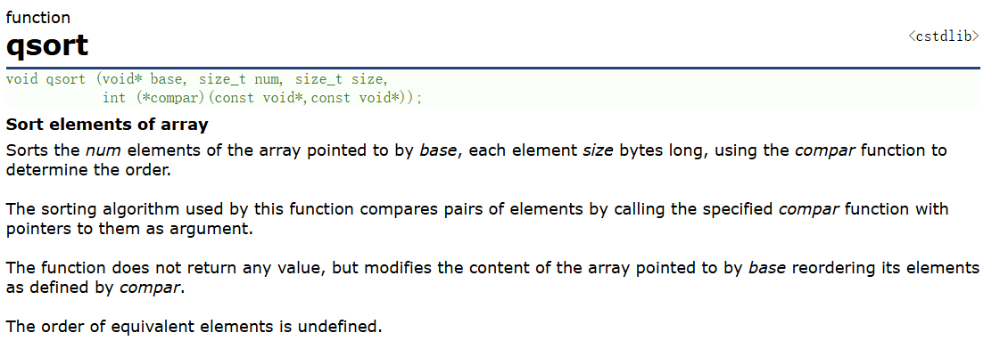

# 目录
- [一、函数传参](#一函数传参)
  - [函数指针](#函数指针)
  - [函数传参的实现](#函数传参的实现)
- [二、void*类型作为形参](#二void类型指针作为形参的情况)


# 一、函数传参
函数也可以作为参数进入自定义函数。（ps.Python在这一块比C好写多了……）
## 函数指针
函数也有指针，类型是由输入的形参类型和输出的类型决定。比如对于参数为两个整型变量，输出为整型的函数，函数指针的类型就是`int (*)(int, int)`，当我用函数指针`int (*p)(int, int) = func`定义p之后，p就可以作为函数使用，也可以作为参数放入自定义函数中。
## 函数传参的实现
下面我们来着手实现一下函数传参。
在函数定义的时候，格式类似于`int Func(int (*p)(int, int), int, char)`。
比如我要实现一个Add_1函数，要求对所有的输入为一个整型变量输出为整型变量的函数输出值加1，也就是对于任意函数`int func(int x)`，Add_1的结果都是func(x) + 1。
```c
#include<stdio.h>

int square(int x) {
	return x * x;
}

int triple(int x) {
	return x * x * x;
}

int Add_1(int (*p)(int), int x) {
	return p(x) + 1;
}


int main() {
	int x;
	scanf("%d", &x);
	printf("%d\n", Add_1(square, x));
	printf("%d\n", Add_1(triple, x));
	return 0;
}
>>>3
10
28
```
把别的函数作为形参的函数在函数式编程被叫做**高阶函数（Higher-order function）**。
可惜不能进行函数嵌套把函数作为返回值。
# 二、void*类型指针作为形参的情况
`void*`指针本身并不具备改动数据的能力，看起来跟别的特定类型的指针来比很鸡肋，但是需要注意的是，它有一个很重要的性质，==**就是可以接收所有类型的指针变量，从而极大增加函数的泛用性**==。以`qsort`函数为例

我们可以在cpp官网看一下qsort函数的定义：
我们会发现，`qsort`的参数base和cmp的参数都是`void*`类型的指针，这意味着它可以接收所有类型的指针，==**我们只需要提前准备好对应形式的cmp函数作为函数指针变量输入我们就可以直接使用这个函数！**==  
例如如果我需要用`qsort`对整型数组进行快排，我只需要设计两个函数的比较函数`compar`即可。  
我们会发现`compar`函数的两个参数前都加了const，这是因为`qsort`函数的比较并不需要对两个值进行更改，因此const的使用可以避免误操作导致数据改动，提高程序的健壮性。
但是`void*`指针本身并不具备解引用的能力，因此我们针对不同的指针需要进行强制类型转换，转换成对应的指针类型之后才能进行解引用操作。
```c
#include <stdio.h>
#include <stdlib.h>

int cmp(const void* a, const void* b) {
	return (*(int*)a - *(int*)b);// 强制类型转换为int指针后解引用进行比较
}

int main() {
	int arr[] = {5, 2, 9, 1, 5, 6};
	int n = sizeof(arr) / sizeof(arr[0]);

	qsort(arr, n, sizeof(int), cmp);

	for (int i = 0; i < n; i++) {
		printf("%d ", arr[i]);
	}
	printf("\n");
	return 0;
}
>>>1 2 5 5 6 9 
```
通过这种方式，我们就可以设计出非常通用的函数，极大提高代码的复用性。

