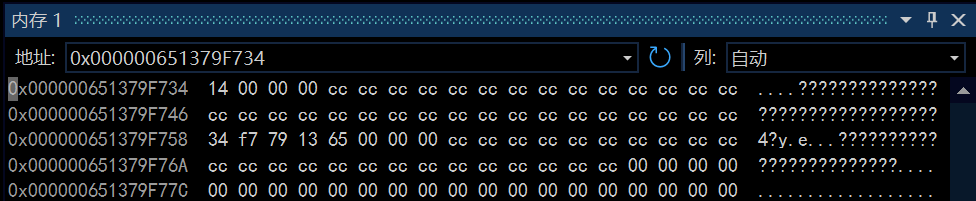
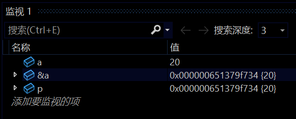

喜欢这个文章可以给主页[Mem0rin](https://blog.csdn.net/2501_93882415?type=blog)点一个关注互三，一起进步！

总算是学完了指针了，目前打算写三篇指针相关的博客，后面两篇讲**指针的运算和遍历**， **指针的传参**。

**文章目录**：

[TOC]

## 一、指针的定义
### （一）指针的概念
简单的来说，==指针就是地址，记录着内存中元素的位置==，指针的操作就是对地址的访问。打个比方来讲，我在公寓里找你家的门牌，指针的操作决定了我接下来的行为：开门，换一个门，到一个指定的门，或者对房间进行改装等。
### （二）指针的类型
指针的使用往往和变量相绑定，不同的变量会有对应的指针变量。
比如:`char`类型的变量的指针就是`char*`，`int`类型的变量的指针就是`int*`，结构体`struct`也有对应的指针，比如对于结构体`struct s`的指针是`struct s*`，甚至我们可以对`char*`求指针，得到二次指针`char**`。
其实还有一种指针类型是`void*`，作用之后会讲到。

### （三）指针的大小
指针变量通常和局部变量一起存储在栈区，**本身不管是什么类型，统一占用4/8个字节**，是4还是8由平台的位数决定。

## 二、指针的赋值
指针是存储地址的变量类型，那怎么存储呢。下面仅介绍最常规的方法：
#### 取地址操作符`&`：
`&`可以得到变量对应的最小地址，最小地址指的是变量在内存中占有的字节的最小地址。比如在以下的代码中：

```c
#include<stdio.h>

int main() {
	int a = 20;
	int* p = &a;
	printf("%p\n", p);
	return 0;
}
>>>0x000000651379F734
```
此时打印出的地址是`0x000000651379F734`，如果我们通过内存窗口去看a此时的内存：

a占用的内存为

```
0x000000651379F734
0x000000651379F735
0x000000651379F736
0x000000651379F737
```
&a会选择其中的最小地址，也就是`0x000000651379F734`。

## 三、指针的使用
有存储就会有调用，那么指针是怎么通过地址对变量产生影响的呢
### 解引用操作符`*`
有取地址操作符`&`，就有解引用操作符`*`，作用是`&`的逆序操作，也就是把地址还原成指向的变量。
在如下代码中：
```c
#include<stdio.h>

int main() {
	int a = 20;
	int* p = &a;
	printf("%p\n", p);
	printf("%d\n", *p);
	printf("%p\n", &*p);
	return 0;
}

>>>000000F53A31FB14
20
000000F53A31FB14
```
`p`表示`a`的地址，为`000000F53A31FB14`，
`*p`通过解引用，还原出了`a`，因此`*p`是整型变量，值为20，
`&*p`可以理解成`&`和`*`相互抵消，也可以理解成`&`把`*p`还原的a再取一遍地址，因此还是`000000F53A31FB14`。