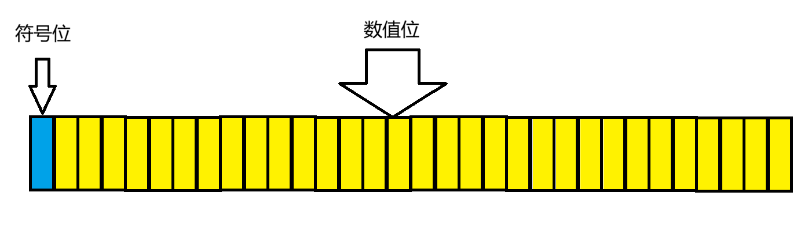
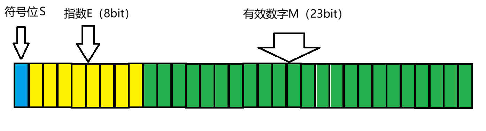

# 目录

- [一、整数的存储方式](#一整数的存储方式)
  - [整数的内存分区](#整数的内存分区)
  - [原码还是补码？](#原码还是补码)
- [二、浮点数的存储方式](#二浮点数的存储方式)
  - [浮点数的表达式](#浮点数的表达式)
    - [有效数字M](#有效数字m)
    - [指数E](#指数e)
  - [读取浮点数](#读取浮点数)
  - [浮点数的失真](#浮点数的失真)
- [三、整数和浮点数的强制类型转换](#三整数和浮点数的强制类型转换)
- [四、int和float的相互赋值](#四int和float的相互赋值)


先说结论：整数和浮点数的内存存储方式是不同的，整数是符号位和31位二进制数，浮点数分为三块，分别表示是符号位S，指数E和有效数字M。  
因此两者之间类型强制转换会出现一定的问题。

# 一、整数的存储方式
## 整数的内存分区
整数（int）共有4个字节32比特，其中最高位表示符号位，1表示负数，0表示正数。  
我们可以用图像表示：  
数值位用31位的二进制表示整数的绝对值，符号位通过0和1表示整数的正负，我们也可以由此得出整数的取值范围为-(2^32^ -1)~2^32^-1。  
需要注意的是，最高位并不一定代表是最高地址，这与编译器大小端的问题相关。

## 原码还是补码？
如果我们用符号位的01表示正负，把绝对值转换成二进制的话，我们就得到了整数的原码。  
比如2的原码就是`00000000000000000000000000000010`，  
-9的原码就是`10000000000000000000000000001001`。
但是仅仅是这样是有问题的，原码的存储方式会出现运算的问题，  
比如如果我要计算`1 + (-1)`，用原码就是`10000000000000000000000000000001 + 00000000000000000000000000000001 = 10000000000000000000000000000010`，得到的不是0，而是-2！  
因此整数的存储采取了补码的存储方式，正整数的原码和补码是一样的，负整数把原码除了符号位全部取反，得到反码，反码再+1就可以得到补码，这样我们就可以实现加减法运算的统一。  
从补码倒推回原码有两种方法，第一种是按照得到补码的过程倒推，补码-1再取反。另一种是补码取反再+1。二进制一般都喜欢加法不喜欢减法所以我更推荐第二种，电脑也是采用的第二种，因为计算过程相同，不需要额外的电路。

# 二、浮点数的存储方式
## 浮点数的表达式
根据国际标准IEEE（电气和电子工程协会）的规范，任意⼀个二进制浮点数V可以表示成：**V = (-1)^S * M * 2^E**
以32位的浮点数为例，浮点数在内存中的存储位置如下所示：


其中S取值为0、1，表示浮点数正负，M为有效数字，用二进制表示，E为指数。
## 有效数字M
1.M的取值范围  
由于有E的指数表示，故M的取值范围仅限于1到2。
2.M的表达方式  
不妨以十进制的小数进行引入，对于小数9.1，我们对小数乘进制数10，9.1就会进一位，变为91，因此我们认为小数点后一位的1的值是10^-1^。对小数除以进制数10，得到0.91，因此小数点第二位是10^-1^/10 = 10^-2^，以此类推，得到小数点后n位的值是10^-n^。
换到二进制，我们不妨以0.1来举例，乘上进制数2，得到1，因此小数点后一位表示2^-1^ ，按照上面的思路倒推，就可以得出小数点后n位的值为2^-n^。  
比如我要表示1.75 ，拆分开来就是2^0^+2^-1^+2^-2^=1.11。  
但我们也要意识到这样的表示方法有一定的局限性，那就是**无法精确地表示每一个小数**，只能用类似于二分法的方式不断逼近，因此有时候会存在一定的误差。  
3.M的存储方式  
由于M的个位始终是1，因此为了节省内存，我们选择不存放开头的1，而是多出来1bit提高有效数字的精度，因此M在内存中只记录小数点后的表达式。  
比如表示1.625 = 1.101，M在内存中就是`10100000000000000000000`。

## 指数E
指数E起到了**进位**的作用，通过把M的小数点后移，把浮点数取值范围从1到2扩大并保持一定的精度。
取值范围要求E既能保证浮点数能够充分接近于零，还能达到较大的取值范围，而E又是无符号的整数，因此在标准中规定E的中值为127，也就是说，表达式中的2^E^实际上代表的是2^E-127^，这里的E表示对是E的存储区域得到的E的值。

因此如果我们要表示任意一个取值范围内的浮点数，只需要写成二进制的表达式，把阶数存放进E，有效数字存放进M即可。

## 读取浮点数
我们现在来试试根据内存存储来倒推浮点数的值：
对于1 10001000 11010000000000000000000
符号位：S = 1，表示负数
指数位：E = 10000010 = 130，2^E^ = 2 ^3^
有效数字：M = 1.1101
V = (-1)^S * M * 2^E = 14.5
我们可以用代码来验证我们的结论
```c
#include <stdio.h>
#include <stdint.h>
#include <string.h>

int main(void) {
    float f;
    uint32_t bits = 0x41680000u; 
    memcpy(&f, &bits, sizeof f);
    printf("%f\n", f);
    return 0;
}
>>>14.500000
```
## 浮点数的失真
虽说浮点数因为E的存在取值范围可以非常接近于0，也可以达到2^128^的数量级，但是浮点数仍有他的缺点，由于32位浮点数有效数字位只有23位，因此在大于2^24的时候会失真，在接近0的极小值也会被强制转换成0。从下面的代码就能看出，在超出有效数字的表示范围后，大数会失真，虽然都是0.0000，但是x被强制转换成了0
```c
#include <stdio.h>
#include <float.h>

int main(void) {
    float f;
    f = (float)_CRT_INT_MAX - 1;
    printf("%d\n", _CRT_INT_MAX);
    printf("%f\n", f);
    float x = 1e-50f;
    printf("%.40f\n", FLT_MIN);
    printf("%.40f\n", x);
    // 检查是否真的为0
    if (x == 0.0f) {
        printf("x精确等于0\n");
    }
    if (FLT_MIN != 0.0f) {
        printf("FLT_MIN不等于0\n");
    }
    return 0;
}
>>>2147483647
2147483648.000000
0.0000000000000000000000000000000000000118
0.0000000000000000000000000000000000000000
x精确等于0
FLT_MIN不等于0
```

# 三、整数和浮点数的强制类型转换
因此我们意识到，存储方式的不同会导致强制类型转换的时候会出现一定的问题。
```c
#include<stdio.h>

int main() {
		union
	{
		float f;
		int n;
	} un;
	un.f = 9.0;
	printf("n = %d\n", un.n);
	un.n = 9;
	printf("f = %f\n", un.f);
	return 0;
}
>>>n = 1091567616
f = 0.000000
```
这是因为整数和浮点数共用同一个地址，但是采取不一样的读取方式。
9在int上对应的是0000 0000 0000 0000 0000 0000 0000 1001，对应的就是float的1.001× 2^-146^，输出为0，9在float上对应的是0 10000010 001 0000 0000 0000 0000 0000，也就是int的1091567616。

# 四、int和float的相互赋值
可能你会和我有同样的想法：如果我把一个float类型的变量赋值给int类型的变量，并不会发生这种情况啊。

```c
#include<stdio.h>

int main() {
	int a = 9.0f;
	printf("a = %d\n", a);
	float f = 9;
	printf("f = %f\n", f);
	return 0;
}
>>>a = 9
f = 9.000000
```
因为赋值的过程是传值的，而我们前面的操作是共享地址的，两者不能一概而论。
以上。
